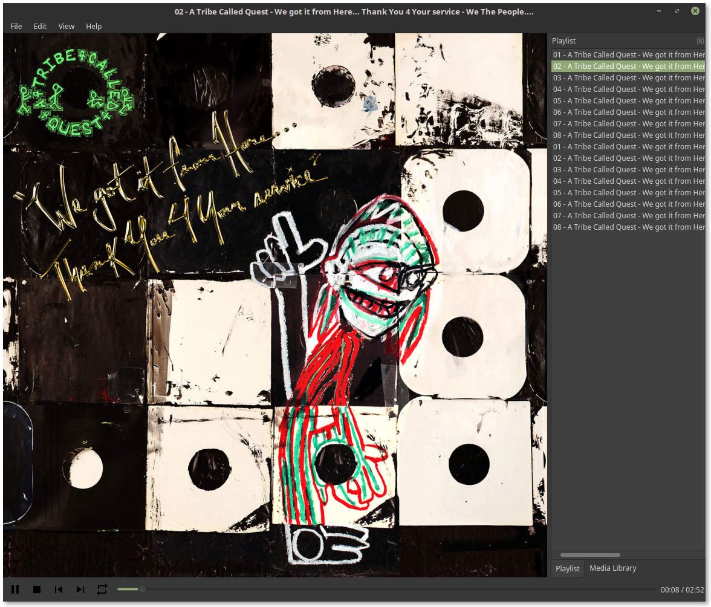
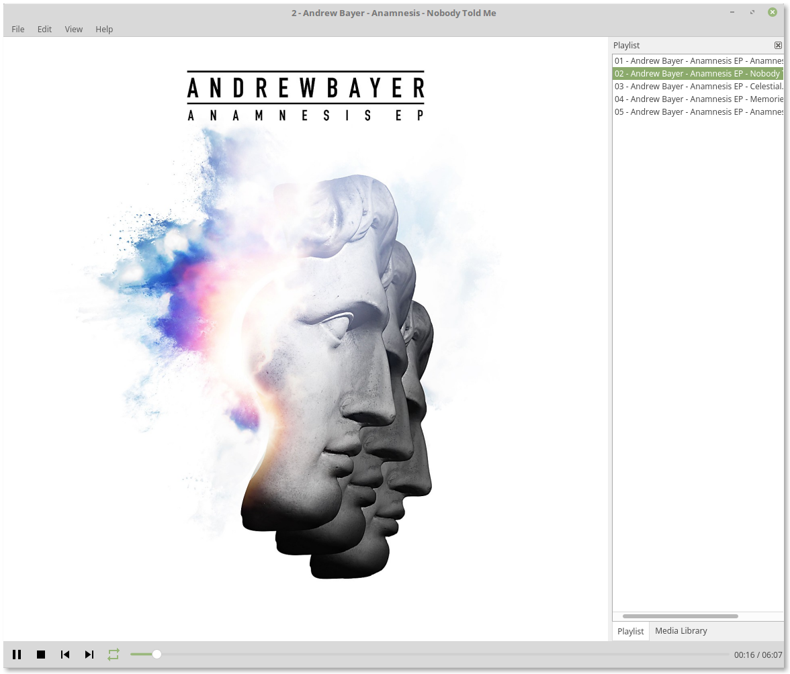

.. image:: mosaic/images/mosaic.png

|travis| |appveyor| |coverage| |dependency| |codacy| |pypi| |status| |pyversions| |wheel| |license|

********
Features
********

* Displays correctly scaled cover art meta data in the main window
* Provides media information including bitrate, bits per sample, and sample rate
* Media library and playlist browser for easy access listening
* Supports FLAC and MP3 file formats
* Cross platform UI utilizes the user's system theme

************
Installation
************

Mosaic requires Python and the PyQt5 library installed locally. For PyQt5 install instructions please visit: https://www.riverbankcomputing.com/software/pyqt/download5

With your environment set, simply run the following command to install Mosaic::

    $ pip3 install mosaic-music

If you would rather install from source, run the following commands::

    $ git clone https://github.com/mandeep/Mosaic.git
    $ cd Mosaic
    $ python setup.py install

*****
Usage
*****

Mosaic can be run with the following command::

    $ mosaic

**********
Change Log
**********

To see the Mosaic change log, click here_.

.. |travis| image:: https://travis-ci.org/mandeep/Mosaic.svg?branch=master
    :target: https://travis-ci.org/mandeep/Mosaic
.. |appveyor| image:: https://ci.appveyor.com/api/projects/status/ix2iwaqqgs98gjqq?svg=true
    :target: https://ci.appveyor.com/project/mandeep/mosaic
.. |coverage| image:: https://img.shields.io/coveralls/mandeep/Mosaic/master.svg
    :target: https://coveralls.io/github/mandeep/Mosaic
.. |dependency| image:: https://dependencyci.com/github/mandeep/Mosaic/badge
    :target: https://dependencyci.com/github/mandeep/Mosaic
.. |codacy| image:: https://img.shields.io/codacy/grade/bae3a2a675c84a5da7863e46f25441fe.svg
    :target: https://www.codacy.com/app/bhutanimandeep/Mosaic/dashboard
.. |pypi| image:: https://img.shields.io/pypi/v/mosaic-music.svg
    :target: https://pypi.python.org/pypi/mosaic-music
.. |status| image:: https://img.shields.io/pypi/status/mosaic-music.svg
    :target: https://pypi.python.org/pypi/mosaic-music
.. |pyversions| image:: https://img.shields.io/pypi/pyversions/mosaic-music.svg
    :target: https://pypi.python.org/pypi/mosaic-music
.. |wheel| image:: https://img.shields.io/pypi/format/mosaic-music.svg
    :target: https://pypi.python.org/pypi/mosaic-music
.. |license| image:: https://img.shields.io/pypi/l/mosaic-music.svg
    :target: https://pypi.python.org/pypi/mosaic-music

.. _here: https://github.com/mandeep/Mosaic/blob/master/CHANGELOG.rst
