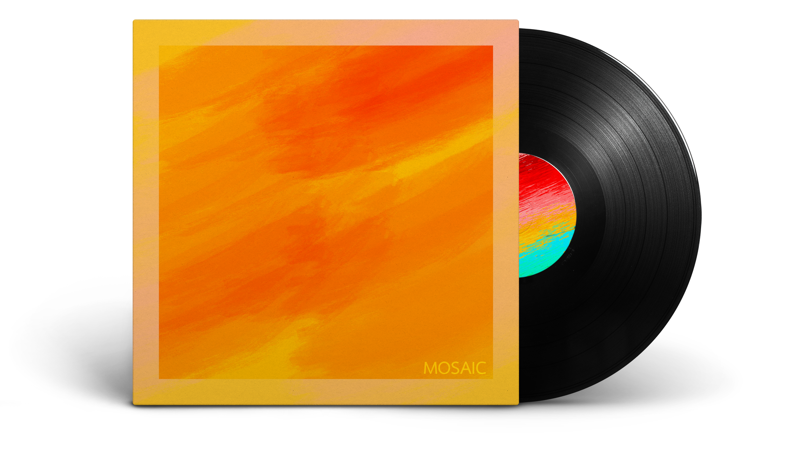

|travis| |coverage| |pypi| |pyversions| |wheel| |license|

Mosaic is a cover art focused media player built with Python and the PyQt5 library. The application displays in the main window the cover art of the song currently playing.

.. image:: mosaic/images/screen.png

.. image:: mosaic/images/screen2.png

*********
Features
*********

* Displays correctly scaled cover art meta data in the main window
* Provides media information including bitrate, bits per sample, and sample rate
* Media library and playlist browser for easy access listening
* Supports FLAC and MP3 file formats

*************
Installation
*************

Mosaic requires Python and the PyQt5 library installed locally. For PyQt5 install instructions please visit: https://www.riverbankcomputing.com/software/pyqt/download5

With your environment set, simply run the following command to install Mosaic::

    pip3 install mosaic-music

If you would rather install from source, run the following commands::

    git clone https://github.com/mandeepbhutani/Mosaic.git
    cd Mosaic
    python setup.py install

******
Usage
******

Mosaic can be run with the following command::

    mosaic

*********
Changelog
*********

To see the Mosaic changelog, click here_.

.. |travis| image:: https://travis-ci.org/mandeepbhutani/Mosaic.svg?branch=master
    :target: https://travis-ci.org/mandeepbhutani/Mosaic
.. |coverage| image:: https://img.shields.io/coveralls/mandeepbhutani/Mosaic/master.svg
    :target: https://coveralls.io/github/mandeepbhutani/Mosaic
.. |pypi| image:: https://img.shields.io/pypi/v/mosaic-music.svg
    :target: https://pypi.python.org/pypi/mosaic-music
.. |pyversions| image:: https://img.shields.io/pypi/pyversions/mosaic-music.svg
    :target: https://pypi.python.org/pypi/mosaic-music
.. |wheel| image:: https://img.shields.io/pypi/format/mosaic-music.svg
    :target: https://pypi.python.org/pypi/mosaic-music
.. |license| image:: https://img.shields.io/pypi/l/mosaic-music.svg
    :target: https://pypi.python.org/pypi/mosaic-music

.. _here: https://github.com/mandeepbhutani/Mosaic/CHANGELOG.rst